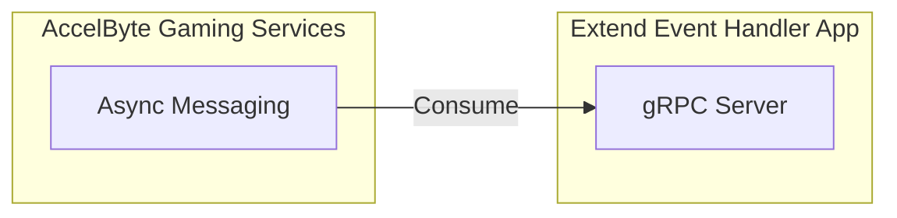

# extend-event-handler-am-consumer



`AccelByte Gaming Services` (AGS) capabilities can be enhanced using 
`Extend Async Messaging` apps. `Extend Async Messaging` provides a managed 
message queue infrastructure that enables asynchronous 
communication between Extend apps through a publish/subscribe pattern for 
custom game events.

## Overview

This repository provides a project template for an `Extend Async Messaging` 
app written in `Go`. It includes sample implementations for consuming custom game events using the managed message queue infrastructure. 
Additionally, it comes with built-in instrumentation for observability, ensuring 
that metrics, traces, and logs are available upon deployment.

You can clone this repository to begin developing your own `Extend Async Messaging`
app. Simply modify this project by implementing your custom logic to consume messages from topics based on your game's needs.

## Project Structure

Here are some important folders you need to know to be able to start modifying
this project.

```text
...
├── pkg
│  ├── pb
│    └── async_messaging   # Generated gRPC code for async messaging
│  ├── proto
│    └── async_messaging   # Async messaging proto specs (*.proto)
│  └── service
│    └── asyncMessagingHandler.go    # Consumer logic implemented here
...
```

> :exclamation: This template includes the proto files for consuming messages from topics. You can modify `asyncMessagingHandler.go` 
to implement your custom game logic for message processing. 

## Prerequisites

1. Windows 11 WSL2 or Linux Ubuntu 22.04 or macOS 14+ with the following tools installed:

   a. Bash

      - On Windows WSL2 or Linux Ubuntu:

         ```
         bash --version

         GNU bash, version 5.1.16(1)-release (x86_64-pc-linux-gnu)
         ...
         ```

      - On macOS:

         ```
         bash --version

         GNU bash, version 3.2.57(1)-release (arm64-apple-darwin23)
         ...
         ```

   b. Make

      - On Windows WSL2 or Linux Ubuntu:

         To install from the Ubuntu repository, run `sudo apt update && sudo apt install make`.

         ```
         make --version

         GNU Make 4.3
         ...
         ```

      - On macOS:

         ```
         make --version

         GNU Make 3.81
         ...
         ```

   c. Docker (Docker Desktop 4.30+/Docker Engine v23.0+)
   
      - On Linux Ubuntu:

         1. To install from the Ubuntu repository, run `sudo apt update && sudo apt install docker.io docker-buildx docker-compose-v2`.
         2. Add your user to the `docker` group: `sudo usermod -aG docker $USER`.
         3. Log out and log back in to allow the changes to take effect.

      - On Windows or macOS:

         Follow Docker's documentation on installing the Docker Desktop on [Windows](https://docs.docker.com/desktop/install/windows-install/) or [macOS](https://docs.docker.com/desktop/install/mac-install/).

         ```
         docker version

         ...
         Server: Docker Desktop
            Engine:
            Version:          24.0.5
         ...
         ```

   d. Go v1.24

      - Follow [Go's installation guide](https://go.dev/doc/install).

      ```
      go version

      go version go1.24.0 ...
      ```
      
   e. [Postman](https://www.postman.com/)

      - Use binary available [here](https://www.postman.com/downloads/)

   f. [extend-helper-cli](https://github.com/AccelByte/extend-helper-cli)

      - Use binary available [here](https://github.com/AccelByte/extend-helper-cli/releases)

   > :exclamation: In macOS, you may use [Homebrew](https://brew.sh/) to easily install some of the tools above.

2. Access to `AccelByte Gaming Services` environment.

   a. Base URL:

      - Sample URL for AGS Shared Cloud customers: `https://spaceshooter.prod.gamingservices.accelbyte.io`
      - Sample URL for AGS Private Cloud customers:  `https://dev.accelbyte.io`

   b. [Create a Game Namespace](https://docs.accelbyte.io/gaming-services/services/access/reference/namespaces/manage-your-namespaces/) if you don't have one yet. Keep the `Namespace ID`.


   c. [Create an OAuth Client](https://docs.accelbyte.io/gaming-services/services/access/authorization/manage-access-control-for-applications/#create-an-iam-client) with confidential client type. Keep the `Client ID` and `Client Secret`.
   
   > :info: Basic client credentials are sufficient for this template. Specific permissions may be required based on your custom implementation.

## Setup

To be able to run this app, you will need to follow these setup steps.

1. Create a docker compose `.env` file by copying the content of [.env.template](.env.template) file.

   > :warning: **The host OS environment variables have higher precedence 
   compared to `.env` file variables**: If the variables in `.env` file do not 
   seem to take effect properly, check if there are host OS environment 
   variables with the same name.  See documentation about 
   [docker compose environment variables precedence](https://docs.docker.com/compose/how-tos/environment-variables/envvars-precedence/) 
   for more details.

2. Fill in the required environment variables in `.env` file as shown below.

   ```
   AB_BASE_URL=https://demo.accelbyte.io      # Base URL of AccelByte Gaming Services environment
   AB_CLIENT_ID='xxxxxxxxxx'                  # Use Client ID from the Prerequisites section
   AB_CLIENT_SECRET='xxxxxxxxxx'              # Use Client Secret from the Prerequisites section
   AB_NAMESPACE='xxxxxxxxxx'                  # Use Namespace ID from the Prerequisites section
   ```

## Building

To build this app, use the following command.

```
make build
```

## Running

To (build and) run this app in a container, use the following command.

```
docker compose up --build
```

## Testing

### Test in Local Development Environment

This app can be tested locally using [Postman](https://www.postman.com/).

1. Run this app by using the command below.

   ```shell
   docker compose up --build
   ```

2. Open `Postman`, create a new `gRPC request`, and enter `localhost:6565` as the URL.

   

   > :warning: **If you are running [grpc-plugin-dependencies](https://github.com/AccelByte/grpc-plugin-dependencies) stack alongside this project as mentioned in [Test Observability](#test-observability)**: Use `localhost:10000` instead of `localhost:6565`. This way, the `gRPC server` will be called via `Envoy` service within `grpc-plugin-dependencies` stack instead of directly.

3. Select `AsyncMessagingConsumerService/onMessage`

   

   Send a message to the consumer by copying and pasting the sample JSON below, then click `Invoke`:

   ```json
   {
     "body": "{\"eventType\":\"PlayerJoined\",\"playerId\":\"user123\",\"timestamp\":\"2025-10-27T12:00:00Z\"}",
     "topic": "PlayerJoined",
     "metadata": {
       "traceId": "abc123xyz",
       "sentTimestamp": "1698422400000"
     }
   }
   ```
 
4. If successful, you should see an empty response `{}` and corresponding log messages in your docker compose console output.

   

### Test Observability

To be able to see the how the observability works in this app locally, there are few things that need be setup before performing tests.

1. Uncomment loki logging driver in [docker-compose.yaml](docker-compose.yaml)

   ```
    # logging:
    #   driver: loki
    #   options:
    #     loki-url: http://host.docker.internal:3100/loki/api/v1/push
    #     mode: non-blocking
    #     max-buffer-size: 4m
    #     loki-retries: "3"
   ```

   > :warning: **Make sure to install docker loki plugin beforehand**: Otherwise,
   this project will not be able to run. This is required so that container logs
   can flow to the `loki` service within `grpc-plugin-dependencies` stack. 
   Use this command to install docker loki plugin: `docker plugin install grafana/loki-docker-driver:latest --alias loki --grant-all-permissions`.

2. Clone and run [grpc-plugin-dependencies](https://github.com/AccelByte/grpc-plugin-dependencies) stack alongside this project. After this, Grafana 
will be accessible at http://localhost:3000.

   ```
   git clone https://github.com/AccelByte/grpc-plugin-dependencies.git
   cd grpc-plugin-dependencies
   docker compose up
   ```

   > :exclamation: More information about [grpc-plugin-dependencies](https://github.com/AccelByte/grpc-plugin-dependencies) is available [here](https://github.com/AccelByte/grpc-plugin-dependencies/blob/main/README.md).

3. Perform testing. For example, by following [Test in Local Development Environment](#test-in-local-development-environment).

## Deploying

After completing testing, the next step is to deploy your app to `AccelByte Gaming Services`.

1. **Create an Extend Async Messaging app**

   Create topics in the Admin Portal under the Async Messaging section for your namespace.

   Create a new Extend Event Handler app that will consume messages from your topics.

   On the **App Detail** page, take note of the following values.
   - `Namespace`
   - `App Name`

   Under the **Environment Configuration** section, set the required secrets:
   - Secrets
      - `AB_CLIENT_ID`
      - `AB_CLIENT_SECRET`
   
   > :info: Additional environment variables may be required based on your custom implementation.

2. **Build and Push the Container Image**

   Use [extend-helper-cli](https://github.com/AccelByte/extend-helper-cli) to build and upload the container image.

   ```
   extend-helper-cli image-upload --login --namespace <namespace> --app <app-name> --image-tag v0.0.1
   ```

   > :warning: Run this command from your project directory. If you are in a different directory, add the `--work-dir <project-dir>` option to specify the correct path.

3. **Deploy the Image**
   
   On the **App Detail** page:
   - Click **Image Version History**
   - Select the image you just pushed
   - Click **Deploy Image**

## Next Step

Proceed by modifying this `Extend Async Messaging` app template to implement your own custom logic for consuming messages.

For more details about Extend apps, see the [Extend documentation](https://docs.accelbyte.io/gaming-services/services/extend/).

